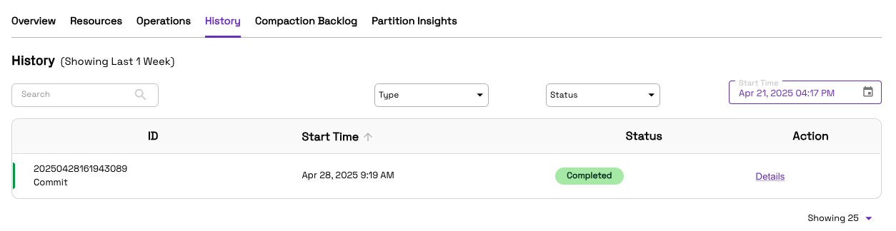

# Redshift Spectrum Onehouse Integration
## Context
This guide outlines how to integrate Onehouse-managed data with Amazon Redshift Spectrum for seamless querying. By setting up a Stream Capture in Onehouse and cataloging data into AWS Glue, users can expose Hudi-managed datasets directly to Redshift Spectrum through an external schema. This allows Redshift to efficiently query Onehouse-managed lakehouse data without needing to move or duplicate it, enabling powerful analytics on live data.
## Steps
### Onehouse: Create a stream capture
* Follow the steps highligted in the [docs](https://docs.onehouse.ai/docs/product/ingest-data/stream-captures) to create a Onehouse Stream Capture
* Make sure you choose AWS Glue Catalog as one of the catalog options. Follow [Create Catalog](https://docs.onehouse.ai/docs/product/ingest-data/catalogs/aws-glue-metastore) docs to setup this up
* Once the first batch of ingestion is complete, the Metadata Sync servive will catalog the data to Glue Data Catalog
  
  
### AWS: Create external schema
* Upon the first successful Metadata Sync to Glue, the table will be ready to be queried by Redshift Spectrum

* A necessary pre-requisute to query the external tables in Redshift Spectrum is to **create a schema**

```
CREATE EXTERNAL SCHEMA IF NOT EXISTS <schema_name>
FROM data catalog
DATABASE '<glue_database_name>'
IAM_ROLE 'arn:aws:iam::<accountId>:role/redshift-glue-s3-full-access-role'
REGION '<region>';
```
> Note1: To work as expected, Redshift needs to have access to Glue Catalog and S3. Make sure you add adequate policies to the Redshift Role. 

> Note2: Redshift Spectrum’s schema has a 1:1 mapping with Glue Database tables
* So all the tables in `<glue_database_name>` database in AWS Glue can be queried from Redshift Spectrum now

### AWS: Querying the tables
* This includes queries like
```
SELECT * FROM <schema_name>.users_pii_ro;
```
